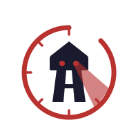

<p align="center">
  
</p>

<h1 align="center">Digital Gulag</h1>

<p align="center">
  The ultimate productivity monitoring system.<br/>
  <a href="https://digital-gulag.com/">digital-gulag.com</a>
</p>

---

You don't know where your time goes. You can't explain why some days work and others don't. You've watched the hours disappear into Slack, Reddit, YouTube — knowing you should be working.

Digital Gulag measures every aspect of your performance. Comprehensively, continuously, with zero manual input.

## How It Works

A lightweight daemon runs on your machine. It captures window titles, idle state, and URLs — no keystrokes, no screenshots, no clipboard. Just enough to know what you're doing.

Every 10 minutes, AI scores your focus and cognitive depth. It builds a timeline of your day in plain language. Not what apps you opened — what you actually did.

The dashboard shows the truth. The productivity curve exposes your patterns. The agent helps you understand them.

## Architecture

```
Rust Daemon (Linux/macOS)  ──►  FastAPI Server  ──►  PostgreSQL
  captures: window, app,         ingestion API        activity_events
  URL, idle state                AI agent              timeline_entries
  buffers in SQLite              integrations          integration_events
                                      │
External APIs (Oura, etc.) ─────────►─┘
                                      │
                              Vue 3 Dashboard
```

| Layer | Tech |
|---|---|
| Backend | FastAPI, SQLAlchemy 2.0, asyncpg, Alembic |
| AI Agent | LangGraph, Claude (Anthropic), Redis |
| Frontend | Vue 3, Vite, Pinia, TypeScript, Chart.js |
| Daemon | Rust, Tokio, reqwest, rusqlite |
| Database | PostgreSQL 15 |
| Infra | Docker Compose, Nginx, Prometheus, Grafana |

## Features

- **Productivity Curve** — Focus score plotted over time at 10-minute resolution. The shape of your day, visible and measurable.
- **AI Timeline** — Raw window switches become a human-readable story. What you did, when, and how well.
- **Categories & Rules** — You define what counts as work. Custom categories, plain-English classification rules.
- **Agent Chat** — Something wrong? Tell the agent. It reads your data, fixes mistakes, answers questions.
- **Integrations** — GitHub, Oura ring, and more. The more data, the better the analysis.
- **Open Source** — Every line of code is public. Deploy it yourself. Use your own LLM. Full sovereignty.

## Quick Start

```bash
# Start the full stack
make dev-up

# Create a user
make dev-user you@example.com yourpassword

# Open the dashboard
open http://localhost:5173
```

### Install the Daemon

Download the latest binary for your platform from [GitHub Releases](https://github.com/galthran-wq/digitalgulag/releases).

```bash
# Configure
cp config.example.toml ~/.digitalgulag/config.toml
# Edit with your server URL and credentials

# Install as service
digitalgulag-daemon install
```

## Development

```bash
# Docker dev environment
make dev-up                      # start all services
make dev-down                    # stop
make dev-logs server             # tail server logs
make dev-db                      # psql shell

# Server tests
make dev-test-db                 # create test DB (once)
make dev-test-migrate            # apply migrations
make dev-test                    # run all tests

# Frontend
cd client
npm install
npm run dev
```

## Privacy

The daemon captures only window titles, app names, URLs, and idle state. No keystrokes. No screenshots. No clipboard. No audio. All data stays on your server. You can self-host everything, use your own LLM, and delete your data at any time.

## License

MIT

---

<p align="center">
  Now close this page and go do something worth measuring.
</p>
